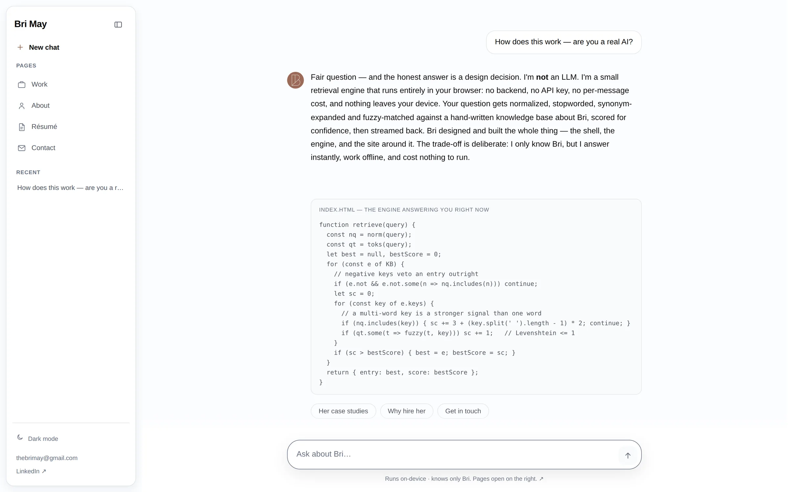

# imbrimay.com

[](https://github.com/thebrimay-wq/bri-portfolio-2/actions/workflows/deploy.yml)

Portfolio of **Bri May**, AI-Native Senior Product Designer. I design the product, then I ship the code.

The homepage is **Brix**, a conversational site whose answer engine runs entirely in the visitor's browser: plain HTML, CSS, and JavaScript, no build step, no backend, no API key. Ask it anything, or open a deep link such as [`/?q=what broke`](https://imbrimay.com/?q=what%20broke) and it answers from a hand-written knowledge base and shows its own source when asked.

**Live: [imbrimay.com](https://imbrimay.com)** · **What is public and where the rest lives: [imbrimay.com/code](https://imbrimay.com/code/)**



## The engine

Everything the chat does lives in `index.html`. There is no model behind it.

1. `norm()` lowercases and strips punctuation; `toks()` drops stopwords and expands a small synonym map (`coding` → `code`, `gcs` → `global`, and so on).
2. `retrieve()` scores every knowledge-base entry: a multi-word key found verbatim in the question scores 3 plus 2 per extra word; a single word scores 1 when it fuzzy-matches a query token (exact, shared 5-character prefix, or Levenshtein ≤ 1). An entry's `not` list vetoes it outright, which is how "case study" stops matching the education entry through the word "study".
3. `route()` decides what to do with the score: a confident hit (≥ 2) is answered; otherwise a navigation intent (greeting, case studies, résumé, contact) is tried; a weak hit (1) is answered with the runner-up offered as an alternative; and an engineering question with no match (`broke`, `fix`, `tradeoff`, `architecture`, `test`, `why`) is routed to the what-broke entry rather than a fallback. The fallback itself lists the three nearest topics the engine does know.
4. `streamInto()` types the answer out token by token with a stop control. One-turn memory resolves "tell me more" and "the second one" after a list.

The code excerpt Brix renders in chat is the real `retrieve()`, copied verbatim into a `text/plain` block; the Code page shows the same function.

## Accessibility decisions

- **Streaming that announces once.** Token streaming mutates the DOM about ninety times per answer. The thread is `aria-live="off"`; a separate polite live region announces the finished answer exactly once. The audit measures the mutation count.
- **Tokens, three times.** Every color is a custom property defined for light, system dark, and a manual toggle persisted to `localStorage` and applied in `<head>`, so there is no flash of the wrong theme. Worst-case contrast is measured against both the page and the card surface in both modes; the floor is 4.5:1.
- **No JavaScript, no problem.** Reveal animations are scoped to an `html.js` class, images declare intrinsic dimensions, and the homepage ships a full `<noscript>` version with the same hero copy.
- **Keyboard first.** The first tab stop on every page is a skip link; on the homepage it moves focus into the composer. The side panel manages focus in and back out, and Esc closes it.

## Running the checks

Three scripts under `.claude/skills/portfolio-review/scripts/` encode every defect class that has actually shipped here. Run them after any change to `index.html`, `styles/site.css`, a case study, or images.

```bash
# 1. Engine probe: 50 recruiter and engineer questions plus the regression set. Seconds, no browser.
node .claude/skills/portfolio-review/scripts/probe-engine.mjs

# 2. Browser audit: 44 checks (404s and broken images after a full scroll, sideways scroll at
#    320/375/768px, contrast in both themes, head hygiene, no-JS render, skip links, the live-region
#    count, Brix features, core flows). Audits the built site, the way the deploy merges public/images/.
npm install --no-save playwright && npx playwright install chromium
bash .claude/skills/portfolio-review/scripts/build-site.sh /tmp/portfolio-review/_site
(cd /tmp/portfolio-review/_site && python3 -m http.server 8899 &)
node .claude/skills/portfolio-review/scripts/browser-audit.mjs http://127.0.0.1:8899

# 3. Asset audit: unreferenced files, dead weight, rasters over 600 KB, total deployed image weight.
python3 .claude/skills/portfolio-review/scripts/asset-audit.py

# Résumé PDF, printed from the résumé page's @media print stylesheet (real text, single column).
node .claude/skills/portfolio-review/scripts/print-resume.mjs http://127.0.0.1:8899 resume/BriMay_Resume.pdf
```

The full pass, including the judgment checklist the scripts cannot cover, is in [`.claude/skills/portfolio-review/SKILL.md`](.claude/skills/portfolio-review/SKILL.md).

## Layout

```
index.html            The homepage: a three-column app shell (rail / chat / side panel). The knowledge
                      base, the retrieval engine, streaming, and the UI are all in this one file.
styles/site.css       The shared stylesheet: design tokens (light, dark, manual toggle), reset, nav,
                      footer, buttons, scroll reveal.
scripts/nav.js        Inner-page nav: mobile menu, theme toggle, skip link, footer year.
scripts/main.js       Scroll reveal for inner pages.
scripts/embed.js      Pages opened inside the homepage's side panel hide their own chrome; the saved
                      theme is applied before first paint.
work/ aimee-ai/       Case studies: Global Content Studio, Brix, Aimee, the Financial Finesse Hub.
code/                 What is public and where the rest lives, with the engine excerpt.
about/ resume/        Static pages. Page <style> blocks hold only page-specific CSS.
contact/
facts.md              The facts the copy is built from, with sources, and what is still TODO(bri).
src/                  A React + Vite mirror. A development sandbox, not deployed.
.github/workflows/    Deploy: static files copied to GitHub Pages on push to main.
```

## Running locally

The deployed site needs no install:

```bash
python3 -m http.server 8000    # then open http://localhost:8000
```
